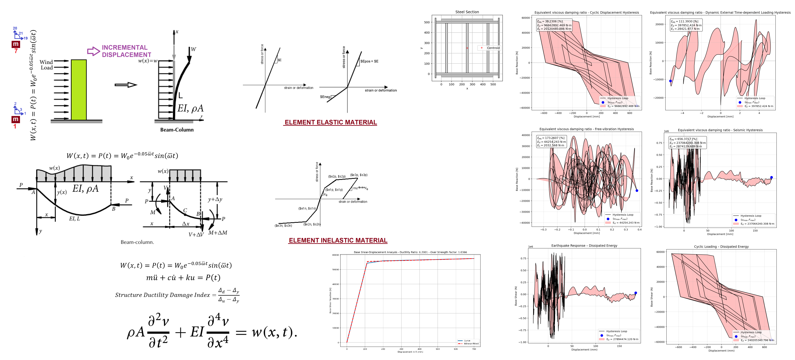

# COMPREHENSIVE NONLINEAR SEISMIC ASSESSMENT OF A STEEL COLUMN : AN OPENSEES FRAMEWORK FOR STATIC PUSHOVER, CYCLIC DEGRADATION, STATIC TIME-HISTORY AND DYNAMIC TIME-HISTORY ANALYSIS

 

 
THIS PYTHON SCRIPT IS WRITTEN BY SALAR DELAVAR GHASHGHAEI (QASHQAI)
