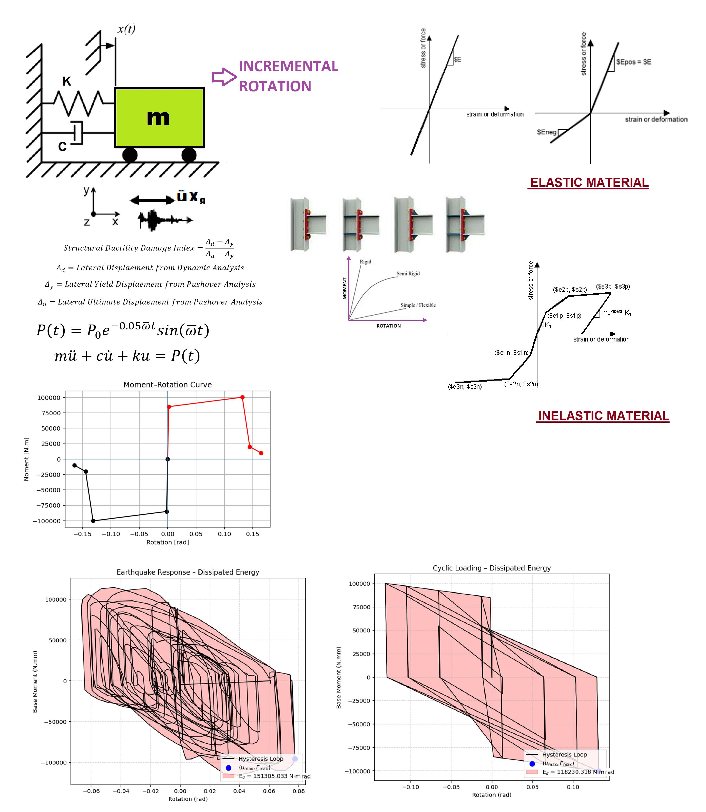

# COMPREHENSIVE NONLINEAR SEISMIC ASSESSMENT OF A SEMI-RIGID CONNECTION AS A SINGLE-DEGREE-OF-FREEDOM (SDOF) STRUCTURE: AN OPENSEES FRAMEWORK FOR STATIC PUSHOVER, CYCLIC DEGRADATION, STATIC TIME-HISTORY AND DYNAMIC TIME-HISTORY ANALYSIS        

Evaluation of Structural Ductility Damage Index & Energy Dissipation Capacity Index

---

**Author:** Salar Delavar Ghashghaei (Qashqai)  
**Email:** salar.d.ghashghaei@gmail.com  

---

## 1. Overview

This repository implements a complete performance-based earthquake engineering (PBEE) workflow for a **semi-rigid connection** idealised as a rotational Single-Degree-of-Freedom (SDOF) system in OpenSeesPy.

The model captures the nonlinear moment–rotation behaviour of a semi-rigid joint through a multi-linear hysteretic material (with strength degradation) and evaluates two key performance indicators:

| Index | Meaning |
|-------|---------|
| **Ductility Damage Index (DI)** | Measures how far the connection has progressed toward its ultimate rotation capacity |
| **Energy Dissipation Capacity Index (EDCI)** | Ratio of hysteretic energy dissipated under earthquake loading to the maximum energy dissipation capacity obtained from a full cyclic protocol |
| **Equivalent Viscous Damping Ratio** | Equivalent viscous damping extracted from the hysteresis loops |

Eight complementary analysis protocols are executed in a single consistent framework.

---

## 2. Eight Analysis Protocols

| # | Protocol | Description |
|---|----------|-------------|
| 1 | **PERIOD** | Eigenvalue analysis → fundamental period \( T \) and modal properties |
| 2 | **STATIC** | Gravity / constant load analysis establishing the initial state |
| 3 | **PUSHOVER** | Rotation-controlled monotonic pushover → capacity curve, plastic mechanism, period elongation |
| 4 | **CYCLIC_DISPLACEMENT** | Symmetric cyclic rotation protocol (increasing amplitude) → full hysteresis, pinching, energy dissipation capacity |
| 5 | **STATIC_EXTERNAL_TIME-DEPENDENT_LOADING** | Quasi-static analysis under \( P(t) = P_0 e^{-0.05\omega t}\sin(\omega t) \) |
| 6 | **DYNAMIC_EXTERNAL_TIME-DEPENDENT_LOADING** | Dynamic analysis under the same time-dependent loading with Newmark integration |
| 7 | **FREE-VIBRATION** | Free vibration from initial conditions → logarithmic-decrement damping ratio |
| 8 | **SEISMIC** | Multi-directional seismic excitation (ground accelerations in X & Y) with Rayleigh damping (3 %) |

---

## 3. Structural Model

### Geometry & Degrees of Freedom
- 1-D model (`-ndm 1 -ndf 1`)
- Node 1: fixed base  
- Node 2: rotational mass node (semi-rigid connection DOF)

### Material (Semi-Rigid Connection)
| Parameter | Value | Unit |
|-----------|-------|------|
| Yield Moment \( M_y \) | 85 000 | N·m |
| Ultimate Moment \( M_u \) | 1.18 \( M_y \) | N·m |
| Elastic Rotational Stiffness \( K_e \) | 45 000 000 | N·m/rad |
| Yield Rotation \( \theta_y \) | \( M_y / K_e \) | rad |
| Ultimate Rotation \( \theta_u \) | 0.1315 | rad |
| Hardening ratio \( b \) | \( (M_u-M_y)/(\theta_u-\theta_y)/K_e \) | – |
| Damping ratio | 3 % | – |

**Material options**
- `INELASTIC` → multi-linear hysteretic material with strength degradation (`Hysteretic` / custom force-deformation backbone)
- `ELASTIC` → linear elastic (tension/compression independent)

A viscous damper is placed in parallel to represent inherent damping.

---

## 4. Key Performance Metrics Computed

- Moment–rotation hysteresis loops  
- Base moment time-history  
- Instantaneous period elongation  
- Ductility Damage Index evolution  
- Energy Dissipation Capacity Index (EDCI)  
- Equivalent viscous damping ratio  
- Fragility curves for four damage states (Slight / Moderate / Severe / Failure)  
- Markov-chain probability of failure (optional)

---
## 5. Repository Structure

53_SDOF_SEMI_RIGID_CONNECTION_8_ANA/
├── P(t)_SDOF_SEMI_RIGID_CONNECTION_8_ANA.py   ← Main driver script
├── ANALYSIS_FUNCTION.py
├── BILINEAR_CURVE.py
├── DAMAGE_INDEX_FUN.py
├── DAMPING_RATIO_FUN.py
├── EIGENVALUE_ANALYSIS_FUN.py
├── EQULIVALENT_VISCOUS_DAMPING_RATIO_FUN.py
├── FRAGILITY_CURVE_FUN.py
├── OPENSEEES_HYSTERETICSM_FORCE_DISP_FUN.py
├── PERIOD_FUN.py
├── PLOT_1D_SPRING.py
├── RAYLEIGH_DAMPING_FUN.py
├── Ground_Acceleration_X.txt
├── Ground_Acceleration_Y.txt
├── COVER_SEMI-RIGID_CONNECTION.png
├── PDF_P(t)_SDOF_SEMI_RIGID_CONNECTION_8_ANA.pdf
└── PPT_P(t)_SDOF_SEMI_RIGID_CONNECTION_8_ANA.pptx

---

