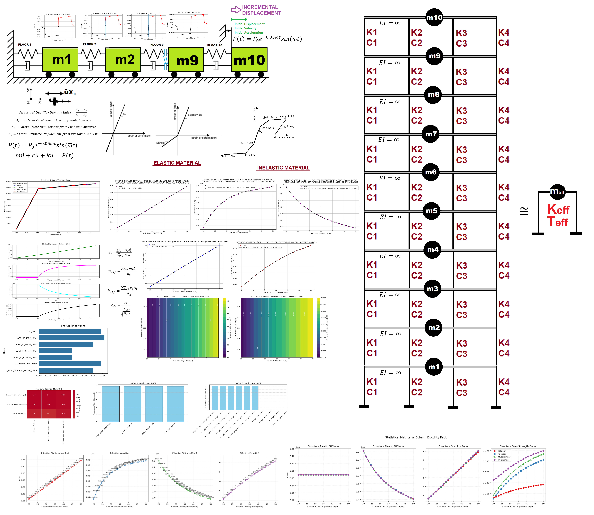

# SENSITIVITY ANALYSIS OF COLUMN DUCTILITY RATIO AND OPENSEES VIA PUSHOVER ANALYSIS OF A MULTI-DEGREE-OF-FREEDOM STRUCTURE AND EVALUATION OF A MULTILINEAR FITTING CURVE FOR STRUCTURAL ELASTIC STIFFNESS, PLASTIC STIFFNESS, DUCTILITY RATIO, AND OVER-STRENGTH FACTOR COMPREHENSIVE NONLINEAR SEISMIC ASSESSMENT OF A MULTI-DEGREE-FREEDOM (MDOF) STRUCTURE: AN OPENSEES FRAMEWORK FOR STATIC PUSHOVER, CYCLIC DEGRADATION, STATIC TIME-HISTORY AND DYNAMIC TIME-HISTORY ANALYSIS     

# تحلیل حساسیت نسبت شکل‌پذیری ستون و نرم‌افزار اوپن‌سیس از طریق تحلیل پوش‌آور یک سازه چند درجه آزادی، همراه با ارزیابی منحنی برازش چندخطی برای سختی کشسان سازه، سختی خمیری، نسبت شکل‌پذیری و ضریب مقاومت افزون؛ ارزیابی جامع غیرخطی لرزه‌ای یک سازه چند درجه آزادی: چارچوبی در اوپن‌سیس برای تحلیل پوش‌آور استاتیکی، افت چرخه‌ای، تاریخچه زمانی استاتیکی و تحلیل تاریخچه زمانی دینامیکی.

 

# EQUIVALENT SDOF SYSTEM DERIVATION VIA DISPLACEMENT-BASED SEISMIC DESIGN PROCEDURE WITH PUSHOVER ANALYSIS

