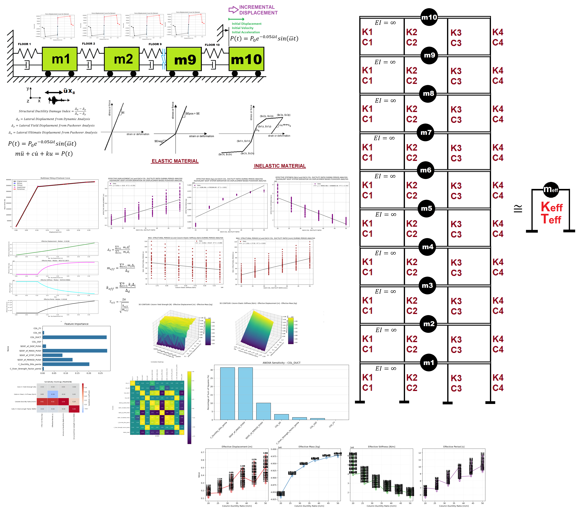
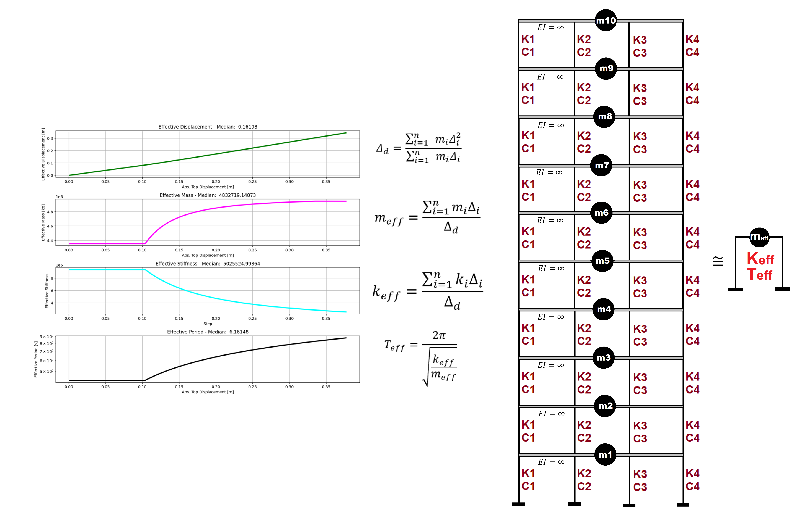

# SENSITIVITY ANALYSIS OF COLUMN YIELD STRENGTH, ELASTIC STIFFNESS, DUCTILITY RATIO, OVER-STRENGTH FACTOR AND OPENSEES VIA PUSHOVER ANALYSIS OF A MULTI-DEGREE-OF-FREEDOM STRUCTURE AND EVALUATION OF A MULTILINEAR FITTING CURVE FOR STRUCTURAL ELASTIC STIFFNESS, PLASTIC STIFFNESS, DUCTILITY RATIO, AND OVER-STRENGTH FACTOR   

# تحلیل حساسیت مقاومت تسلیم ستون، سختی الاستیک، نسبت شکل‌پذیری، ضریب مقاومت افزون و نرم‌افزار OpenSees از طریق تحلیل پوش‌آور یک سازه چند درجه آزادی، و ارزیابی منحنی برازش چندخطی برای سختی الاستیک سازه، سختی پلاستیک، نسبت شکل‌پذیری و ضریب مقاومت


 

# EQUIVALENT SDOF SYSTEM DERIVATION VIA DISPLACEMENT-BASED SEISMIC DESIGN PROCEDURE WITH PUSHOVER ANALYSIS



# FY_KE_DUCT_OSF_SENSITIVITY_PUSHOVER_MDOF

**Sensitivity Analysis of Column Yield Strength (Fy), Elastic Stiffness (Ke), Ductility Ratio (μ), and Over-Strength Factor (Ω) via Nonlinear Static Pushover Analysis of a 10-Story MDOF Shear Building in OpenSeesPy**

**Equivalent SDOF System Derivation through Displacement-Based Seismic Design with Multilinear Idealization of the Capacity Curve**

---

## Overview

This repository implements a comprehensive **parametric sensitivity study** of a 10-story multi-degree-of-freedom (MDOF) shear-building frame using **OpenSeesPy**. The primary objective is to quantify how variations in four key structural parameters affect the global pushover response, the equivalent single-degree-of-freedom (SDOF) system properties, and the multilinear idealization of the capacity curve.

### Key Parameters Investigated
| Parameter | Symbol | Description |
|-----------|--------|-------------|
| Yield Strength | \( F_y \) | Column yield force |
| Elastic Stiffness | \( K_e \) | Initial elastic stiffness of columns |
| Ductility Ratio | \( \mu \) | Ultimate-to-yield displacement ratio |
| Over-Strength Factor | \( \Omega \) (OSF) | Ratio of ultimate force to yield force |

### Structural Configuration
- **10 floors** (stories)
- **4 parallel zero-length springs** (columns) per floor
- Lumped mass model
- Beams assumed infinitely rigid (shear-building idealization)
- Material models: elastic or inelastic (bilinear / multilinear with optional hardening and degradation)
- Analysis type focus: **Displacement-controlled nonlinear static pushover**

---

## Methodology

1. **MDOF Modeling**  
   A 10-story shear building is constructed in OpenSeesPy. Each story consists of four parallel `zeroLength` elements representing the columns, connected to lumped masses.

2. **Parametric Variation**  
   Systematic variation of \( F_y \), \( K_e \), \( \mu \), and \( \Omega \) is performed. For each combination a full pushover analysis is executed.

3. **Pushover Analysis**  
   Displacement-controlled static analysis generates the global base-shear vs. roof-displacement capacity curve. Plastic mechanism formation and story drifts are monitored.

4. **Equivalent SDOF Reduction**  
   Using displacement-based seismic design principles, the MDOF capacity curve is transformed into an equivalent SDOF system. Effective mass, effective height, and modal participation factors are computed.

5. **Multilinear Curve Fitting**  
   The pushover curve is idealized with a multilinear backbone (typically elastic–plastic or elastic–hardening–softening). Fitted parameters include:
   - Structural elastic stiffness \( K_e^{struct} \)
   - Plastic (post-yield) stiffness \( K_p \)
   - System ductility \( \mu_{sys} \)
   - System over-strength \( \Omega_{sys} \)

6. **Sensitivity Metrics & Visualization**
   - ANOVA-based sensitivity ranking
   - Heatmaps of response surfaces
   - Contour plots (2-D / 3-D)
   - Damage Index (DI) evolution
   - Equivalent Viscous Damping Ratio (EVDR)
   - Energy Dissipation Capacity Index (EDCI) compatibility checks

---

## Repository Contents

| File | Description |
|------|-------------|
| `FY_KE_DUCT_OSF_SENSITIVITY_PUSHOVER_MDOF.py` | **Main driver script** – parametric loops, pushover execution, post-processing |
| `ANALYSIS_FUNCTION.py` | Core OpenSees analysis routines (PERIOD, STATIC, PUSHOVER, …) |
| `BILINEAR_CURVE.py` | Bilinear idealization utilities |
| `MULTILINEAR_CURVE_FITTING_FUN.py` | Multilinear backbone fitting algorithm |
| `COMPUTE_EFFECTIVE_PROPERTIES_FUN_PUSHOVER.py` | Effective SDOF properties from pushover |
| `COMPUTE_EFFECTIVE_PROPERTIES_FUN_FREE_VIBRATION.py` | Modal / free-vibration effective properties |
| `DAMAGE_INDEX_FUN.py` | Ductility-based damage index |
| `EQULIVALENT_VISCOUS_DAMPING_RATIO_FUN.py` | EVDR calculation |
| `EIGENVALUE_ANALYSIS_FUN.py` | Eigenvalue / period extraction |
| `RAYLEIGH_DAMPING_FUN.py` | Rayleigh damping matrix construction |
| `ANOVA_SENSITIVITY_FUN.py` | Analysis of variance sensitivity ranking |
| `SENSITIVITY_HEATMAP_FUN.py` | Heatmap generation of parameter influence |
| `SENSITIVITY_PLOTS_ANOVA.py` | ANOVA visualization suite |
| `PLOT_CONTOUR_3D_2D_FUN.py` | 2-D / 3-D contour and surface plots |
| `PLOT_1D_SPRING.py` | Single-spring response visualization |
| `OPENSEEES_HYSTERETICSM_FORCE_DISP_FUN.py` | Hysteretic material force-displacement utilities |
| `SALAR_MATH.py` | Mathematical helper functions |
| `PERIOD_FUN.py` | Period calculation wrappers |
| `DAMPING_RATIO_FUN.py` | Damping ratio utilities |
| `FRAGILITY_CURVE_FUN.py` | Fragility curve generation (optional) |
| `Ground_Acceleration_X.txt` / `Y.txt` | Sample ground-motion records (for optional dynamic checks) |
| `COVER.png` / `COVER_DISPLACEMENT_BASED_PUSHOVER.png` | Graphical covers |
| `PDF_FY_KE_DUCT_OSF_SENSITIVITY_PUSHOVER_MDOF.pdf` | Detailed PDF documentation |
| `PPT_FY_KE_DUCT_OSF_SENSITIVITY_PUSHOVER_MDOF.pptx` | Presentation slides |

---

## Key Features

- Full parametric exploration of \( F_y \), \( K_e \), \( \mu \), \( \Omega \)
- Automatic multilinear idealization of capacity curves
- Equivalent SDOF derivation consistent with displacement-based design
- Comprehensive sensitivity post-processing (ANOVA, heatmaps, contours)
- Modular OpenSeesPy architecture supporting multiple analysis types (PERIOD, STATIC, PUSHOVER, CYCLIC, SEISMIC, …)
- Damage Index, Energy Dissipation Capacity Index, and Equivalent Viscous Damping Ratio evaluation
- High-quality visualization suite for scientific reporting

---

## Requirements

```bash
Python >= 3.8
openseespy
numpy
scipy
matplotlib
pandas          # recommended for result tables
seaborn         # for advanced heatmaps (optional)

