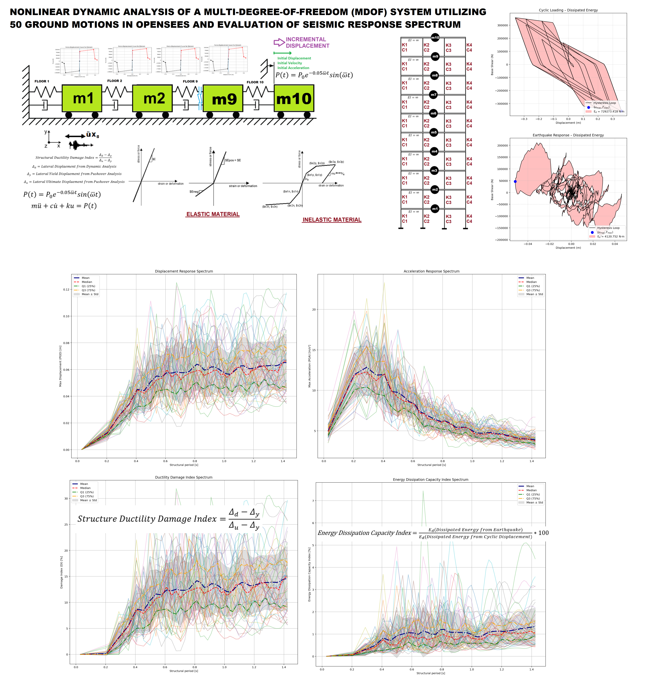

# NONLINEAR DYNAMIC ANALYSIS OF A MULTI-DEGREE-OF-FREEDOM (MDOF) SYSTEM UTILIZING 50 GROUND MOTIONS IN OPENSEES AND EVALUATION OF SEISMIC RESPONSE SPECTRUM



# MDOF Response Spectrum Analysis with Energy Dissipation Capacity Index (EDCI) & Equivalent Viscous Damping Ratio (EVDR)

**Nonlinear Dynamic Analysis of a 10-Story, 4-Column Multi-Degree-of-Freedom (MDOF) System in OpenSees**  
**Seismic Response Spectra · Ductility Damage Index · Energy Dissipation Capacity Index · Equivalent Viscous Damping Ratio**

---

## Overview

This repository provides a complete **OpenSeesPy** framework for the nonlinear dynamic (time-history) analysis of a **10-story MDOF frame** (4 columns per floor) subjected to a suite of ground motions.  

The primary goals are:

1. Construction of **seismic response spectra** (displacement, velocity, acceleration, base shear, etc.).
2. Evaluation of the **Structural Ductility Damage Index**.
3. Computation of the **Energy Dissipation Capacity Index (EDCI)**.
4. Evaluation of the **Equivalent Viscous Damping Ratio (EVDR)**.
5. Supporting analyses: eigenvalue / free-vibration, pushover, cyclic hysteretic, Rayleigh damping, fragility curves, and reliability assessment.

The scripts implement both elastic and inelastic material models and support large suites of artificial or recorded ground motions (the included archive contains a 200-record suite).

**Author:** Salar Delavar Ghashghaei (Qashqai)

---

## Structural Model

| Parameter                    | Description                                      |
|-----------------------------|--------------------------------------------------|
| Number of stories           | 10                                               |
| Columns per floor           | 4                                                |
| Beam idealization           | Rigid (infinite flexural rigidity)               |
| Material models             | Elastic or Inelastic (hysteretic)                |
| Degrees of freedom          | Multi-degree-of-freedom (MDOF)                   |
| Damping                     | Rayleigh damping (user-defined)                  |
| Ground motions              | Suite of artificial / recorded accelerograms     |

The model is suitable for parametric studies of stiffness, strength, ductility, over-strength, and energy dissipation characteristics of multi-story frames.

---

## Key Performance Indices

### 1. Energy Dissipation Capacity Index (EDCI)

\[
\text{EDCI} = \frac{E_{\text{seismic}}}{E_{\text{cyclic}}}
\]

- \(E_{\text{seismic}}\): Hysteretic energy dissipated under a given ground motion (time-history analysis).
- \(E_{\text{cyclic}}\): Maximum energy dissipation capacity obtained from a controlled cyclic (pushover-type) test.

EDCI quantifies how close the seismic demand comes to saturating the structure’s plastic energy absorption capacity. It is a direct proxy for cumulative damage and collapse margin.

### 2. Equivalent Viscous Damping Ratio (EVDR)

Computed from the area of the hysteresis loops and the peak displacement / force of the equivalent linear system. EVDR is used for:

- Equivalent linearization
- Response spectrum adjustment
- Damping modification factors

### 3. Structural Ductility Damage Index

Evaluates the ratio of maximum displacement demand to the yield displacement (or a more refined damage model based on cumulative ductility).

---

## Repository Contents

| File / Folder                                      | Description |
|----------------------------------------------------|-------------|
| `MDOF_RESPONSE_SPECTRUM_EDCI_EVDR.py`              | **Main driver script** – runs the complete analysis suite |
| `ANALYSIS_FUNCTION.py`                             | Core OpenSees analysis routines (time-history, pushover, free-vibration, etc.) |
| `DAMAGE_INDEX_FUN.py`                              | Structural ductility damage index calculation |
| `EQULIVALENT_VISCOUS_DAMPING_RATIO_FUN.py`         | Equivalent viscous damping ratio (EVDR) |
| `BILINEAR_CURVE.py`                                | Bilinear idealization of backbone curves |
| `COMPUTE_EFFECTIVE_PROPERTIES_FUN_PUSHOVER.py`     | Effective stiffness, yield strength, ductility from pushover |
| `COMPUTE_EFFECTIVE_PROPERTIES_FUN_FREE_VIBRATION.py`| Effective properties from free-vibration response |
| `EIGENVALUE_ANALYSIS_FUN.py`                       | Modal periods, mode shapes, participation factors |
| `PERIOD_FUN.py`                                    | Structural period evaluation |
| `RAYLEIGH_DAMPING_FUN.py`                          | Rayleigh damping matrix construction |
| `DAMPING_RATIO_FUN.py`                             | Logarithmic decrement / damping ratio extraction |
| `OPENSEEES_HYSTERETICSM_FORCE_DISP_FUN.py`         | Hysteretic force–displacement processing |
| `FRAGILITY_CURVE_FUN.py`                           | Fragility curve generation |
| `RELAIBILITY.py`                                   | Reliability / probability of exceedance routines |
| `KANAI_TAJIMI.py`                                  | Kanai–Tajimi artificial ground-motion generation |
| `MARKOV_CHAIN.py`                                  | Markov-chain damage state modeling |
| `SALAR_MATH.py`                                    | Mathematical utility functions |
| `200_SEISMIC_TIME_HISTORY.rar`                     | Archive of ground-motion time histories |
| `PDF_MDOF_RESPONSE_SPECTRUM_EDCI_EVDR.pdf`         | Technical report / documentation |
| `PPT_MDOF_RESPONSE_SPECTRUM_EDCI_EVDR.pptx`        | Presentation slides |
| `COVER.png`                                        | Cover image |

---

## Analysis Types Supported

The framework can perform the following analyses (controlled by flags inside the main script):

- **Eigenvalue / Modal analysis**
- **Free-vibration analysis** (with initial displacement or velocity)
- **Static pushover analysis** (displacement-controlled)
- **Cyclic / reversed cyclic pushover** (for full hysteretic capacity)
- **Nonlinear dynamic time-history analysis** under multiple ground motions
- **Response spectrum construction** (displacement, velocity, acceleration, base shear, damage indices, EDCI, EVDR)
- **Fragility analysis**
- **Reliability assessment**

---

## How to Run

### Requirements

```bash
pip install openseespy numpy matplotlib pandas scipy openpyxl

unrar x 200_SEISMIC_TIME_HISTORY.rar

python MDOF_RESPONSE_SPECTRUM_EDCI_EVDR.py

# Typical Output Quantities

Peak floor displacements, velocities, and accelerations
Inter-story drifts
Base shear time histories and spectra
Force–displacement hysteresis loops
Energy dissipation time histories
EDCI for every ground motion
EVDR for every ground motion
Ductility demand and damage index
Fragility curves (acceleration, ductility, EDCI, EVDR based)
Modal periods and effective properties
