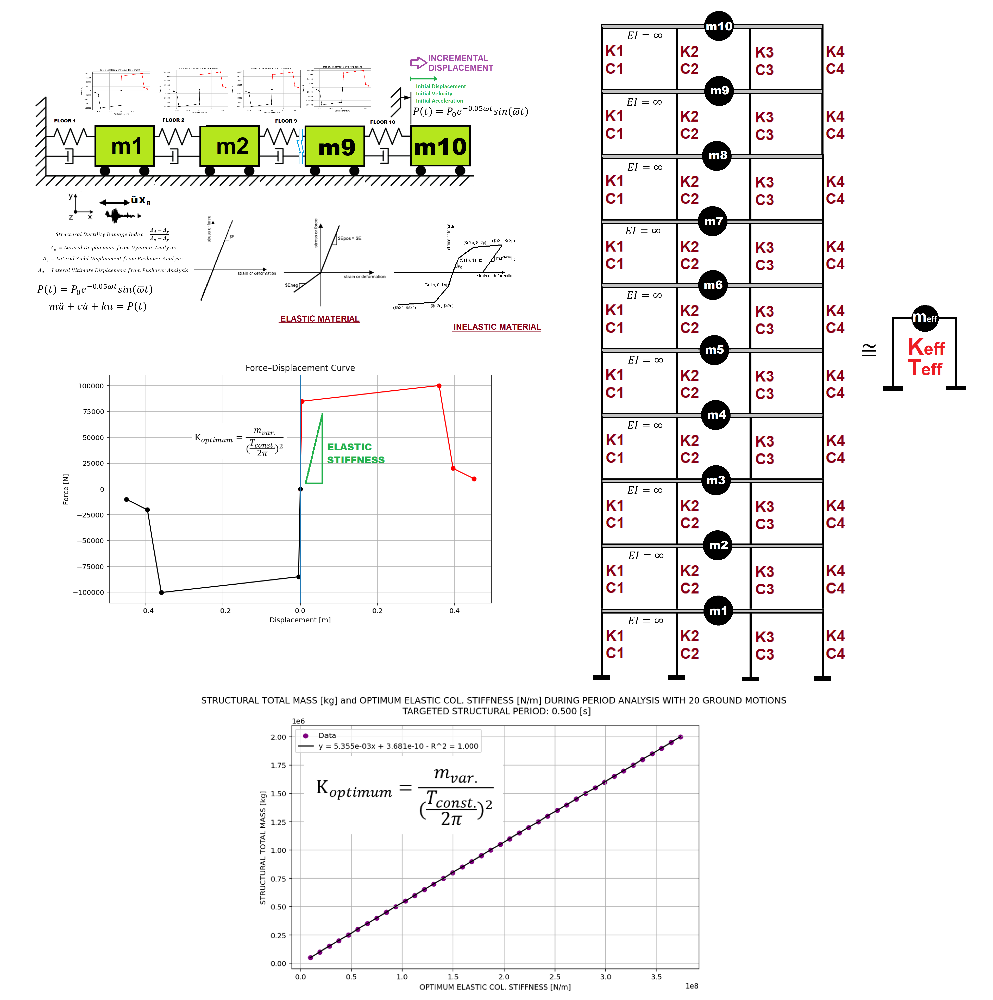

# OPTIMIZATION_KE_PERIOD_VARITIONS

**Optimum Elastic Stiffness of Columns based on Structural Period (Constant Mass)**



## Overview

This OpenSees (Python) example finds the **optimum elastic stiffness** (`Ke`) of the columns in a **10-story MDOF frame** (4 columns per floor) so that the structural period matches a chosen target.

- Mass is kept **constant**
- Target structural period is **varied**
- Optimization uses a **finite-difference Newton–Raphson** solver

## Structure

- 10 floors  
- 4 columns per floor  
- Beams with infinite flexural rigidity (`EI = ∞`)  
- Elastic or inelastic material models  
- Equivalent SDOF system via displacement-based design (pushover)

## Key Features

- Newton–Raphson optimization of column elastic stiffness  
- Structural period analysis (`ANAL_TYPE = 'PERIOD'`)  
- Ductility Damage Index  
- Energy Dissipation Capacity Index (EDCI)  
- Equivalent Viscous Damping Ratio  
- Multiple analysis types (pushover, cyclic, free-vibration, seismic, etc.)

## Main Script

```bash
python OPTIMIZATION_KE_PERIOD_VARITIONS.py
